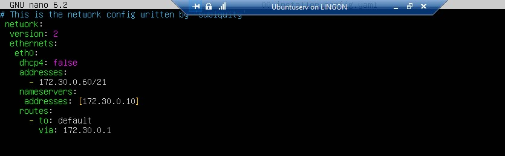
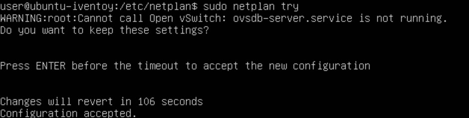
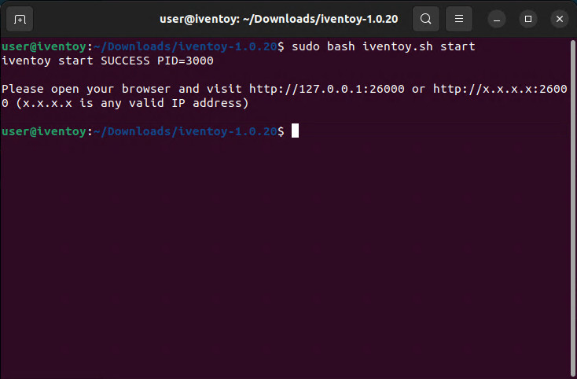

# Ubuntu Server med GUI

</br>  

<!-- toc -->

</br>

> [!TIPS]
> Om du inte har tidigare erfarenhet av Linux läs [detta först.](./omlinux.md)  

## Installation av Ubuntu Server med GUI

Ladda ner [Ubuntu Server 22.04.4 LTS](https://ubuntu.com/download/server/thank-you?version=22.04.4&architecture=amd64&lts=true) och montera ISO:n i ett VM på
Hyper-V som är minst 22 GB.

<video src="./video/Edit_VM.mp4" controls></video>

Ta bort bocken på "Enable Secure Boot" på Security fliken och boota från DVD.  
</br>  

<video src="./video/ubuntu_install.mp4" controls></video>

Tryck <kbd>Enter</kbd> under installation för att gå vidare. Navigera med <kbd>Tab</kbd> . Ändra inget förutom "Layout" till svenskt tangentbord.  

</br>  

Starta om efter installation och tryck <kbd>Ctrl</kbd> + <kbd>D</kbd> för att gå tillbaka till inloggningen om inte det sker automatiskt.
Vid krångel tryck <kbd>Ctrl</kbd> + <kbd>C</kbd>. Börja med att mata in följande för att uppdatera:  

````bash  
sudo apt-get update && sudo apt-get upgrade
````  

GUI installeras med:  

````bash  
sudo apt install ubuntu-desktop
````  

Efter installationen starta om med:  

```bash  
sudo shutdown -r now
```  

Installera även lite extra drivrutiner:  

````bash  
sudo apt install linux-image-extra-virtual  
````  

</br>

## Enhanced Session

Enhanced Session är inte nödvändigt men underlättar hanteringen av VM:et. För att få det att fungera med Ubuntus grafiska
gränssnitt mata in `cd ~/Downloads/` i ett terminalfönster. För att ladda ner mjukvaran mata in:  

````bash
wget <https://raw.githubusercontent.com/Hinara/linux-vm-tools/ubuntu20-04/ubuntu/20.04/install.sh>
````

Mata in `sudo chmod +x install.sh` för att tilldela rättighet att köra filen och starta installationen med
`sudo ./install.sh`. Starta om enheten med `sudo shutdown -r now` eller `sudo reboot` och mata därefter in
`cd ~/Downloads/`  och `sudo ./install.sh` igen. Starta sedan om enheten igen.

Starta Powershell som admin på Windows-värddatorn och mata in:  

````powershell
 Set-VM -VMName “iVentoy_Ubuntu_Server” -EnhancedSessionTransportType HvSocket
````

Ersätt “`iVentoy_Ubuntu_Server`” med namnet på ditt eget VM. Starta om Ubuntu igen. Inloggningsrutan är nu förändrad på Ubuntu (ersatt med xorg display server ) men Enhanced Session är aktiverad och det flyter på bättre.

## Installation av iVentoy

Öppna Firefox och gå till <https://github.com/ventoy/PXE/releases>  och ladda ner Linux-versionen av iVentoy.
Ladda även ner filen "sha256.txt". Öppna ett terminalfönster och navigera till `/Downloads` och mata in
`sha256sum iventoy-1.0.20-linux-free.tar.gz`. Öppna filen "sha256.txt" i filutforskaren genom att klicka på den.

  

Jämför kontrollsumman som skapades med den som finns för Linux-versionen (översta raden) i textfilen. Om dem inte är
identiska så ladda ner filen på nytt.

</br>  

Gå till mappen "Downloads" i filutforskaren och högerklicka på "iventoy-1.0.20-linux-free.tar.gz" och välj “Extract here”.
Ladda ner en [Windows 10 ISO-fil](https://www.microsoft.com/sv-se/software-download/windows10 "Windows 10 ISO länk"),
välj (English - USA), och flytta den till mappen "iso" i iVentoy-mappen.  

## Statisk IP  

Navigera till mappen netplan med `cd /etc/netplan/`. Mata sen in `sudo nano` och tryck <kbd>Tab</kbd> två gånger och sen <kbd>Enter</kbd> för att öppna filen i Nano.  

  

Redigera filen så att den ser ut som ovan. Använd egna IP-nummer etc. Var noga med blankstegen. Spara med <kbd>Ctrl</kbd> + <kbd>S</kbd>. Avsluta med <kbd>Ctrl</kbd> + <kbd>X</kbd>. Testa om inställningarna och formateringen är korrekt med `sudo netplan try`.  

  

Om det ser ut som ovan så tryck <kbd>Enter</kbd>. Varningsmeddelandet kan ignoreras.  

</br>  

  

iVentoy startas från ett terminalfönster med `sudo bash iventoy.sh start` alternativt `sudo ./iventoy.sh start`. Håll ner <kbd>Ctrl</kbd> och klicka på första länken eller öppna Firefox och gå till <http://127.0.0.1:26000> för att använda
iVentoys grafiska gränssnitt. [Klicka för fler val och inställningar](./iventoy.md)  
