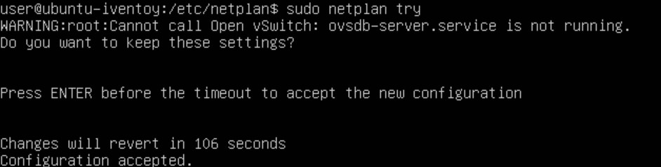

# Ubuntu Server utan GUI (nästan)  

</br>

<!-- toc -->

</br>

## Installation av Ubuntu Server med terminal UI  

</br>  

> [!TIPS]
> Om du inte har tidigare erfarenhet av Linux läs [detta först.](./omlinux.md)  

</br>  

Ladda ner [Ubuntu Server 22.04.4 LTS](https://ubuntu.com/download/server/thank-you?version=22.04.4&architecture=amd64&lts=true "Ubuntu Server LTS länk") och montera ISO:n i ett VM på
Hyper-V som är minst 12 GB.

<video src="./video/Edit_VM.mp4" controls></video>

Ta bort bocken "Enable Secure Boot" på Security fliken och boota från DVD.  
</br>  
</br>  

<video src="./video/ubuntu_install.mp4" controls></video>

Tryck <kbd>Enter</kbd> under installation för att gå vidare. Navigera med <kbd>Tab</kbd> . Ändra inget förutom vid "Layout" till svenskt tangentbord.  

</br>  

Starta om efter installation och tryck <kbd>Ctrl</kbd> + <kbd>D</kbd> för att gå tillbaka till inloggningen om inte det sker automatiskt.
Vid krångel tryck <kbd>Ctrl</kbd>  +  <kbd>C</kbd>. Börja med att mata in följande för att uppdatera systemet:  

````bash  
sudo apt-get update && sudo apt-get upgrade
````  

</br>  
</br>  

> [!NOTERA]  
> iVentoys grafiska gränssnitt kan nås via [extern](./iventoy.md#Öppna-gränssnittet-externt) webbläsare. Programvara kan överföras via en ISO eller t.ex. [SCP](./filetransfer_windows_linux.md). Installering av Firefox & Xorg är valfritt då Ubuntu kan köras "headless".  

</br>  

### Installation av Firefox & Xorg  

iVentoy kräver en webbläsare för att kunna ändra inställningar så mata in följande i terminalfönstret för att installera Firefox med Xorg X display server:  

````Bash
sudo apt install firefox xorg
````  

Starta Firefox genom att mata in `startx` (xorg) i terminalfönstret och sen `firefox` i nästa fönster:  

  

## Installation av iVentoy  

När Firefox startat gå till <https://github.com/ventoy/PXE/releases> och ladda ner senaste Linux-versionen och filen "sha256.txt".
För att avsluta Firefox tryck <kbd>Ctrl</kbd> + </kbd> <kbd>Q</kbd> och skriv sedan `exit` i nästa fönster för att avsluta (xorg).  

Från terminalfönstret laddar man ner med:  

````bash  
wget https://github.com/ventoy/PXE/releases/download/v1.0.20/iventoy-1.0.20-linux-free.tar.gz
````

Textfil:  

````bash  
wget https://github.com/ventoy/PXE/releases/download/v1.0.20/sha256.txt
````  

</br>  

Github kan krångla men då funkar curl:  

````bash  
curl -O https://github.com/ventoy/PXE/releases/download/v1.0.20/iventoy-1.0.20-linux-free.tar.gz
````

Textfil:  

````bash  
curl -O https://github.com/ventoy/PXE/releases/download/v1.0.20/sha256.txt
````  

Filerna hamnar i mappen man är i. Om curl inte är installerad, installera med `sudo apt install curl`.  

</br>  
</br>  

Navigera till hemmappen med `cd`. Mata först in `cd /snap/firefox/common/Downloads`, eller annan mapp om man använt curl, och sen följande kommandorad för att jämföra genererad sha256 med den som finns i textfilen:

````Bash  
sha256sum iventoy-1.0.20-linux-free.tar.gz | sha256sum sha256.txt -c
````  

</br>

  

Det finns tre kontrollsummor i sha256.txt filen men endast Linux-versionen kan jämföras. Kolla så att det står "OK" vid Linux-versionen. Packa upp arkivet till user-mappen genom att mata in:

````Bash
tar -xf iventoy-1.0.20-linux-free.tar.gz /home/user
````  

</br>  
</br>  

> [!TIPS]
> Ubuntu Server har ingen “scrollback buffer”. För att kunna se stora textflöden får man köra en pipe.
> Exempel: `tar --help | less`. Piltangent ned kör en rad åt gången och mellanslag kör en sida. Avsluta genom att trycka Q.

</br>  

## Montera ISO  

Använd [Imgburn](./imgburn.md) (Windows) för att skapa en ISO-fil av [Windows 10 ISO](https://www.microsoft.com/sv-se/software-download/windows10 "Windows 10 ISO länk") och eventuell [autounattend.xml](./skript.md) och anslut den till Ubuntu Server VM:et i Hyper-V.

  

Mata in `lsblk -a` för att lista alla "block size" enheter. "sr0" är den optiska enheten listad som "rom" men är ej monterad.

</br>

Mata in `sudo mount /dev/sr0 /home/user/iventoy-1.0.20/iso/` för att montera den optiska enheten i iVentoys iso-mapp. Om ISO:n tas bort eller VM:et startas om måste `mount` köras igen. För att råda bot på detta konfigurerar man enligt följande:  

````Bash
sudo chown -R $USER:$USER /home/user/iventoy-1.0.20/iso  
````  

Ägarskap över mappen och dess undermappar flyttas nu till användaren (Kontrollera så att sökvägen är rätt beroende på vilka steg du följt ovan). Autostart konfigureras så här:  

````Bash
sudo nano /etc/fstab  
````  

</br>  

  

Lägg till följande rad längst ner:  

````Bash  
/dev/sr0 /home/user/iventoy-1.0.20/iso udf,iso9660 user,utf8 0 0  
````  

Spara med <kbd>Ctrl</kbd> + <kbd>S</kbd> och stäng fönstret med <kbd>Ctrl</kbd> + <kbd>X</kbd>. Den optiska enheten monteras nu automatiskt vid uppstart i iVentoys iso-mapp.  

Kopiera eventuell autounattend.xml-fil till iVentoys skriptmapp:

````Bash
cp /home/user/iventoy-1.0.20/iso/autounattend.xml /home/user/iventoy-1.0.20/user/scripts/
````  

</br>  

## Skapa en symbolisk länk  

Om man monterar den virtuella optiska enheten på en annan plats som exempelvis /mnt/dvd/ så kan man göra en symlink så att den läses från en annan mapp. I exemplet nedan har en ISO-fil på den optiska virtuella enheten länkats till iVentoys iso-mapp.  

````Bash
ln -s /mnt/dvd/Windows10.iso /home/user/iventoy-1.0.20/iso/Windows10.iso
````  

Detta skapar en sym link i iVentoys "iso"-mapp. Växeln -s står för symbolic.  

## Statisk IP  

Navigera till ` /etc/netplan/`. Mata sen in `sudo nano` och tryck <kbd>Tab</kbd> två gånger och sen <kbd>Enter</kbd> för att öppna .yaml-filen i Nano.  

  

Redigera filen så att den ser ut som ovan. Fyll i eget IP-nummer etc. Var noga med blankstegen. Spara med <kbd>Ctrl</kbd> + <kbd>S</kbd> och stäng med <kbd>Ctrl</kbd> + <kbd>X</kbd>. Testa om inställningarna och formateringen är korrekt med `sudo netplan try`.  

  

Om det ser ut som ovan så tryck <kbd>Enter</kbd>. Varningsmeddelandet kan ignoreras.  

iVentoy startas med `sudo bash iventoy.sh start` alternativt `sudo ./iventoy.sh start`. [Klicka för fler val och inställningar](./iventoy.md)  
