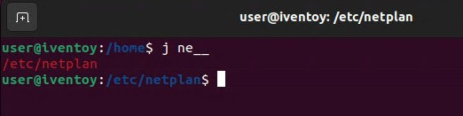
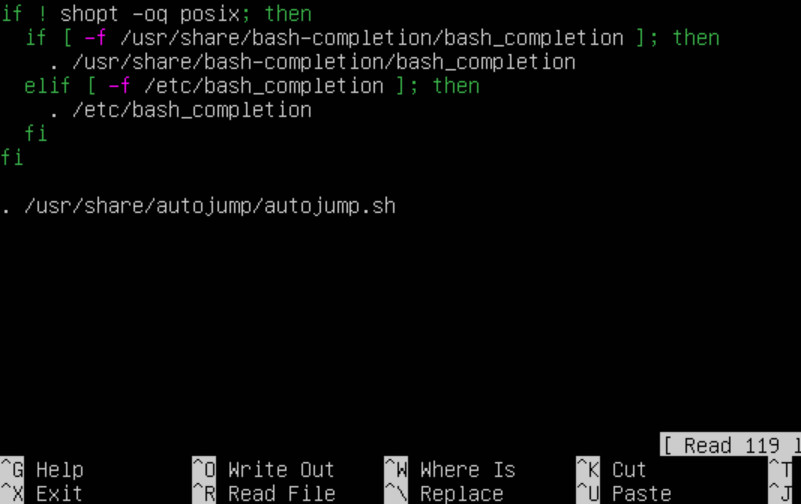

# Autojump

[Autojump](https://github.com/wting/autojump "https://github.com/wting/autojump") kan (nästan) ersätta kommandot `cd` i Ubuntus kommandotolk. Om man navigerat in i en mapp med `cd` sparar Autojump sökvägen till mappen.  

  

Mata in `j` och de två första bokstäverna på mappnamnet du vill gå till och tryck först <kbd>Tab</kbd> och sen <kbd>Enter</kbd> för att gå till mappen.  

Installera Autojump med `sudo apt install autojump`. Mata sen in `cd` för att gå till hemmappen. För att länka Autojump
till Ubuntus kommandotolk Bash, mata in `sudo nano .bashrc` som öppnar filen i textredigeraren nano.

  

Lägg till `. /usr/share/autojump/autojump.sh` i slutet av filen. Spara med <kbd>Ctrl</kbd> + <kbd>S</kbd> och lämna fönstret med <kbd>Ctrl</kbd> + <kbd>X</kbd>.  

Starta om terminalen med <kbd>Ctrl</kbd> + <kbd>D</kbd>  

   

> [!NOTERA]  
> Mappar måste först navigeras till med kommandot `cd` __efter__ installationen av Autojump för att sökvägarna skall registreras.  
