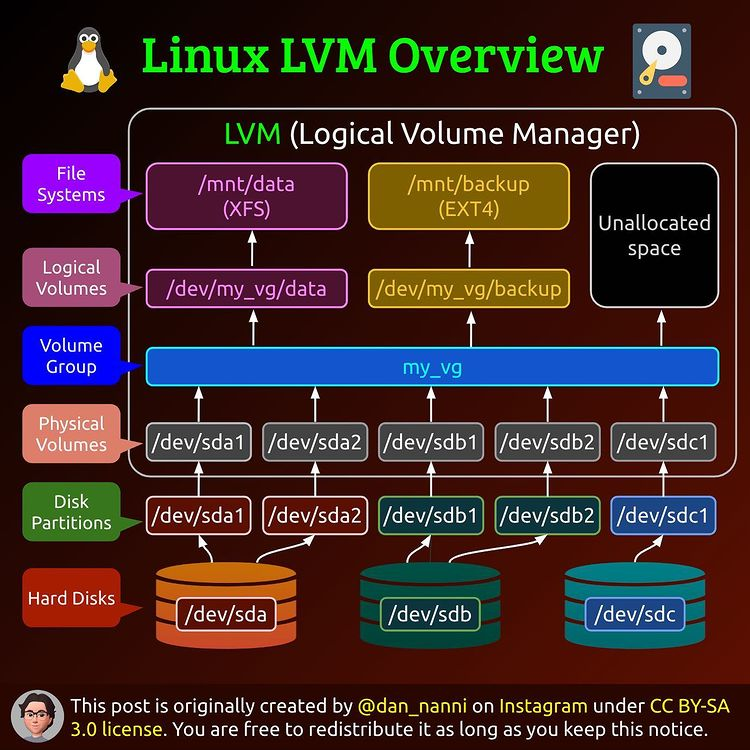
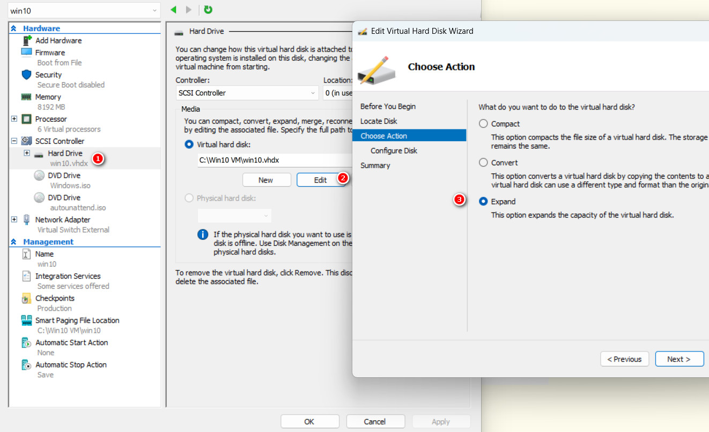

# Utöka utrymme på disk

## En guide för LVM

Autoinställningarna vid installation av Ubuntu Server använder sig av LVM.  

  

Om de vanliga diskverktygen inte klarar av denna strukturen måste man använda sig av terminalen. Kommandon som är användbara inför utökning av utrymmet:

* `df -h` visar partitionsstorleken där växeln -h är ”human readable”.  

* `sudo vgdisplay` visar storleken på Volume Group.

* `sudo lvdisplay` visar Logical Volumes.  

</br>  

För att utöka utrymmet så måste man börja med VM:et i Hyper-V.  

  

1. Välj disken du vill utöka.  
2. Klicka på  "Edit".  
3. Välj "Expand" och sätt storlek i nästa steg.  

</br>  

För att utöka utrymmet matar man först in ..

````Bash
sudo lvextend -l +100%FREE /dev/ubuntu-vg/ubuntu-lv
````  

.. och för att utöka filsystemet över utrymmet:  

````Bash
sudo resize2fs /dev/mapper/ubuntu--vg-ubuntu--lv
````  

Klart.  
