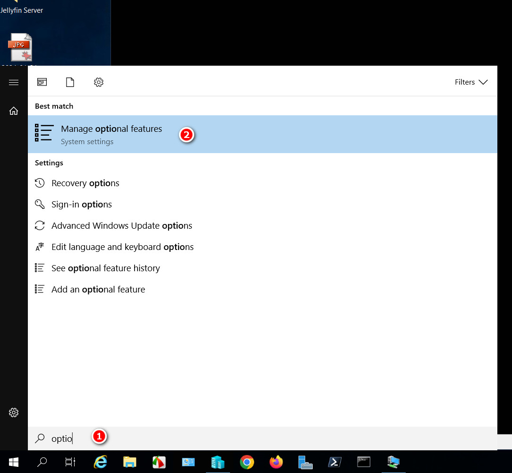
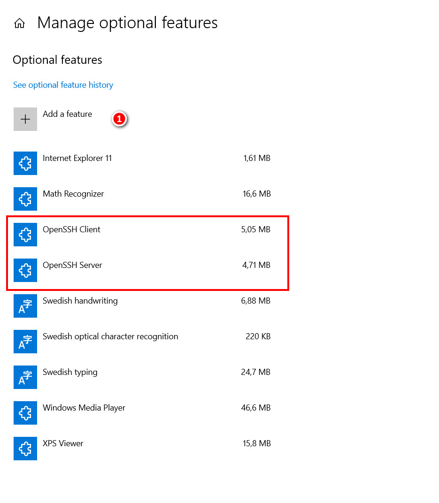
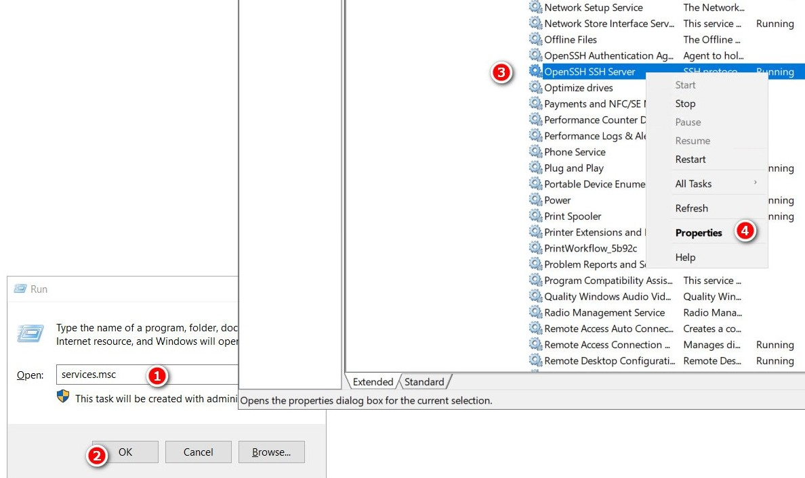
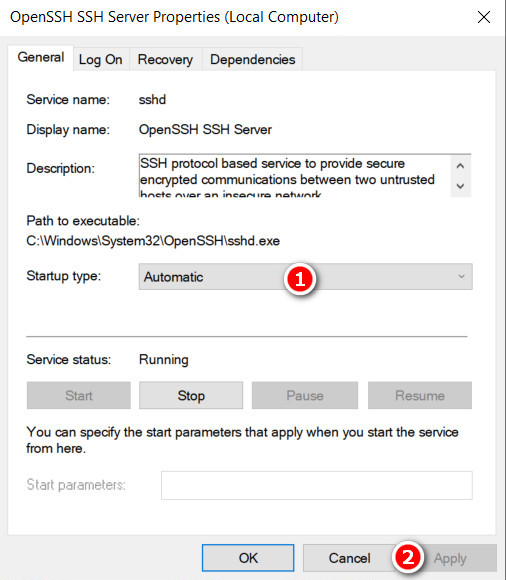
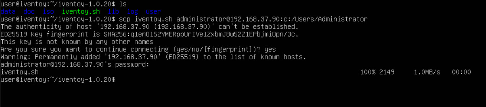
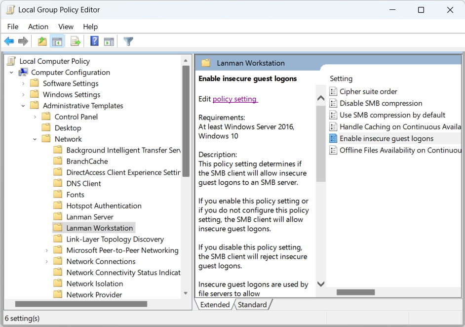

# Filöverföring Windows <span style='font-size:auto;'>&#8596;</span> Linux

<!-- toc -->

## SCP - Secure Copy Protocol  

Enhanced Session funkar inte alltid för att föra över filer. Enheter kan kopplas till vid uppstart med Enhanced Session
men det kanske inte heller alltid funkar.  

För att flytta filer till Ubuntu Server VM finns det dock andra sätt. Navigera till “Home directory” med kommandot `cd`
och mata in `sudo chown user Downloads` där `user` är användarnamnet vid inloggning på Ubuntu. Kommandoraden ger användaren
”user” ägarskap över mappen Downloads. Öppna Powershell (admin) genom att shift-högerklicka i en mapp som en fil ska överföras
från med SCP. Mata in filnamn och mottagare enligt följande:  

````Powershell
scp fil.xxx användarnamn@IP-till-Ubuntu:/sökväg/till/mapp
````  

Exempel:

````Powershell
scp gparted-live-1.6.0-3-amd64.iso user@192.168.37.3:/home/user/Downloads
````

Lösenord kommer att utkrävas av mottagaren (Ubuntu).  

</br>  

För att överföra från Linux till Windows måste SSH installeras först.

  

1. Sök på Optional Features
2. Klicka  

</br>  

  

1. Klicka på Add a feature 
I nästa ruta välj att installera OpenSSH Client och Server.

</br>  

  

1. Tryck <kbd>Win</kbd> + <kbd>R</kbd> och mata in services.msc
2. Klicka OK
3. Bläddra till OpenSSH SSH Server
4. Högerklicka och välj Properties

</br>  

  

1. Välj Automatic
2. Klicka på Apply

Starta om datorn.

</br>

För att överföra till Windows mata in så här:

scp min.fil användarnamnWindows@ip.till.windows:C:/Users/Användare

Exempel:

````bash
scp iventoy.sh administrator@192.168.37.65:C:/Users/Olle
````  

Observera `/`.  

</br>  

  

När frågan om fingerprint dyker upp skriv "yes".
## WinSCP  

Smidigaste sättet att överföra är med WinSCP. Det överför åt båda hållen och kräver ingen förkonfiguration.  

<video src="./filetransfer/WinSCP.mp4" controls></video>

WinSCP hämtas här: <https://winscp.net/eng/download.php>  

## Samba - SMB

För att installera Samba mata in:  

````bash
sudo apt update
sudo apt install samba  
````  

Skapa en delad mapp med `mkdir /home/user/Delad/` där `user` är användarnamnet. För att konfigurera Samba mata in `sudo nano /etc/samba/smb.conf`. Längst ner i fönstret läggs följande rader till:

````default
[Delad]

path = /home/user/Delad
available = yes
valid users = user
read only = no
browseable = yes
public = yes
writable = yes
````  

Tryck <kbd>Ctrl</kbd> + <kbd>S</kbd> för att spara och <kbd>Ctrl</kbd> + <kbd>X</kbd> för att gå tillbaka till kommandotolken.  

</br>  

Mata in `sudo service smbd restart` för att inställingarna skall få effekt. Om brandväggen är aktiverad tillåt Sambas trafik genom att mata in `sudo ufw allow samba`. Skapa ett användarkonto med:  

````Bash
sudo smbpasswd -a user
````  

Användaren `user` som skapas är en existerande systemanvändare. Användaren måste finnas i systemet för att kunna läggas till. Skapa ett lösenord när det efterfrågas. Öppna filhanteraren i Windows och skriv `\\ip-adressen-till-sambaenheten\Delad`. Användarnamn och lösenord efterfrågas.  

</br>

  

Vid problem kan man testa att ändra “Enable insecure guest logons” till "Enable" i Group Policy.  

## Python  

Mata in denna raden från en mapp du vill dela:  

````Bash
python3 -m http.server 8080
````  

För att komma åt mappen och dess undermappar anslut med <http://värdadress:8080> på en extern webbläsare.  
