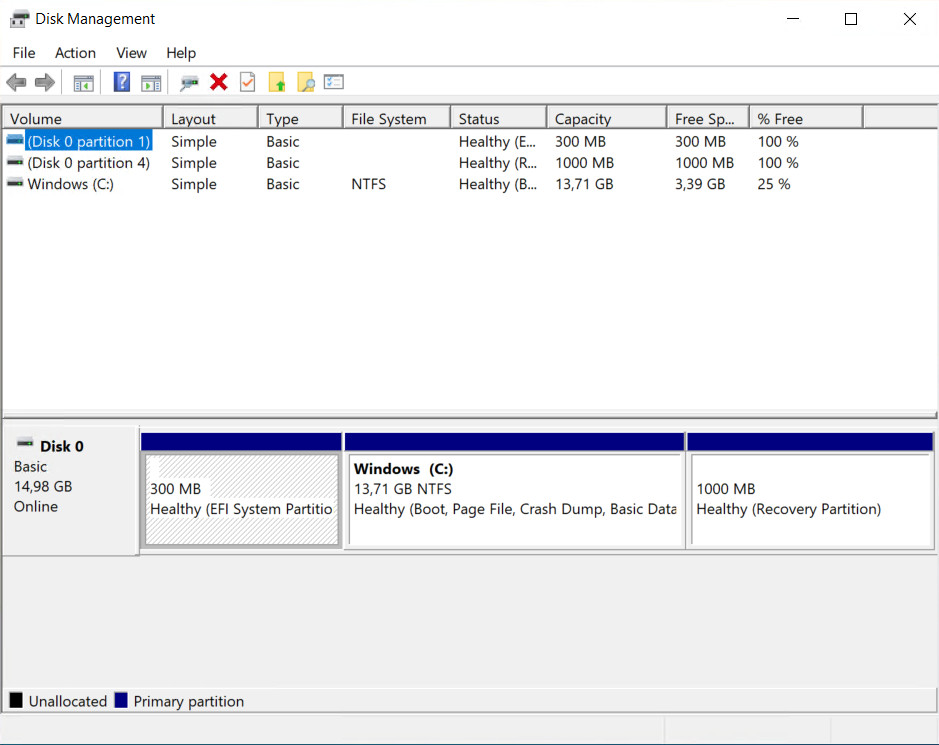

# Gparted  

Gparted är en partitionshanterare. Versionen för den här guiden är Gparted Live som laddas ner via <https://gparted.org/download.php>. Montera ISO:n i ditt VM och sätt den som första boot.  

   

  

Som exempel används Windows som har en Recovery-partition om 1000 MB som tas bort och vars utrymme tilldelas (C:)-partitionen.  

   

   

<video src="./gparted/gparted.mp4" controls></video>  

Gör inställningar enligt videon. När det kommer till ändring av partitionen så går det att ändra genom att dra i flikarna eller skriva in önskad storlek, alternativt klicka på <kbd>+</kbd> eller <kbd> - </kbd> knapparna.  

   

> [!Varning]
> Det finns alltid en liten risk att det går åt pipan. En backup är en bra försäkring.  
