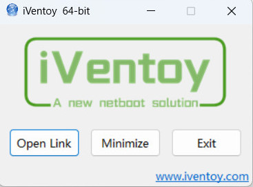
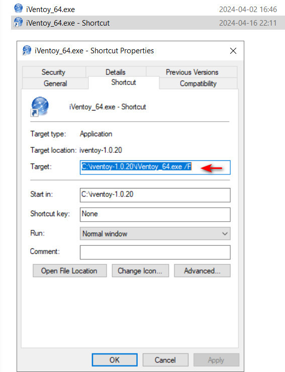
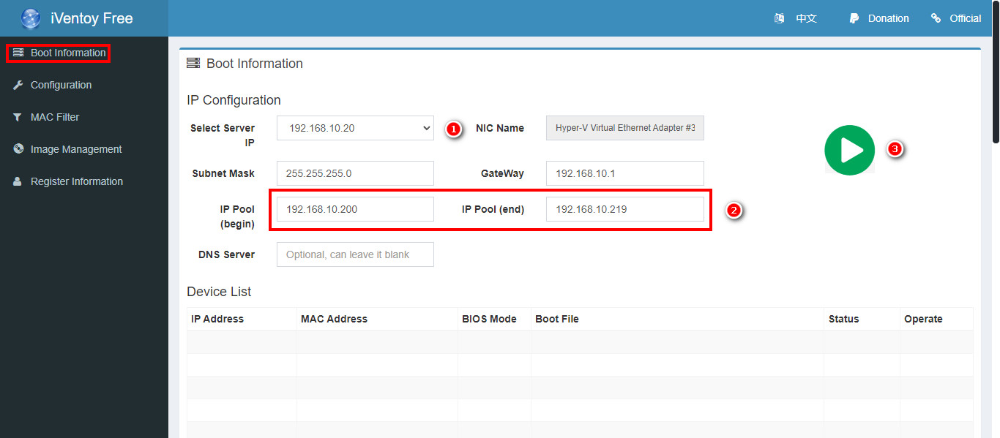
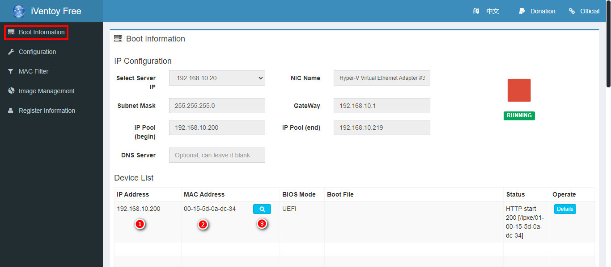
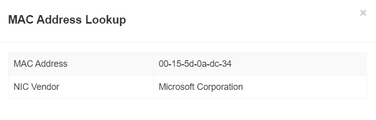
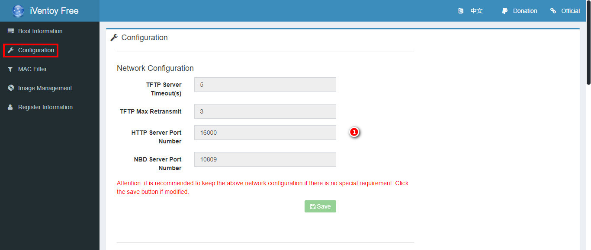
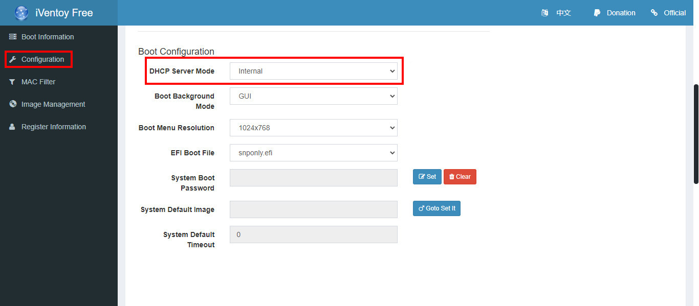
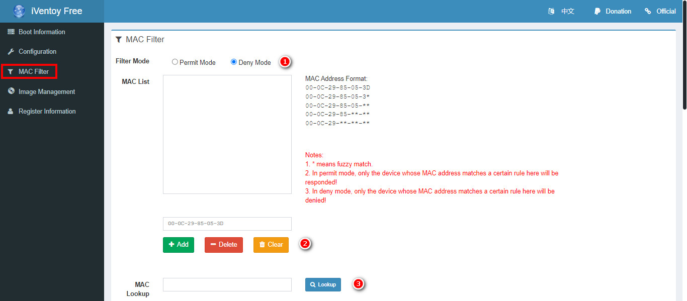
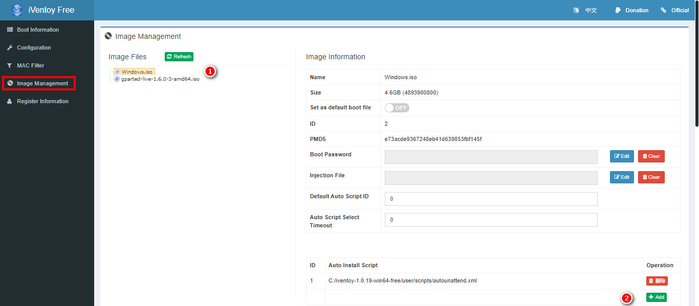
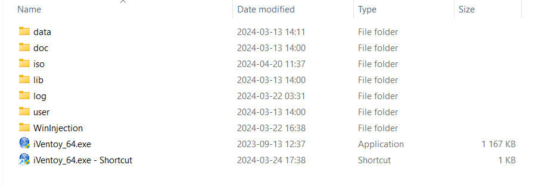

# Snabbguide för iVentoy 1.0.20

<!-- toc -->

## Starta från Windows  

iVentoy startas genom att klicka på __iVentoy_64.exe__ varvid en webbläsarflik startas tillsammans med ett litet programfönster och en ikon i aktivitetsfältet.  



Om iVentoy inte startar måste [Microsoft Visual C++ Redistributable](https://aka.ms/vs/17/release/vc_redist.x64.exe) installeras. iVentoy är kodad för att starta med webbläsaren Chrome och har man inte den installerad, eller vill använda en annan webbläsare, så kan man skapa och konfigurera en genväg.  

</br>  



Högerklicka på den skapade genvägen och välj "Properties". I slutet av sökvägen adderas `/F`. Nästa gång iVentoy startas öppnas en flik i standardwebbläsaren.  

## Starta från Linux Ubuntu  

Starta iVentoy med `sudo bash iventoy.sh start` eller `sudo ./iventoy.sh start`.  

## Öppna gränssnittet externt  

iVentoy kör gränssnittet på http://127.0.0.1:26000. Det går dock att öppna från en annan dator på http://x.x.x.x:26000, där x.x.x.x är adressen till datorn iVentoy-servern körs ifrån.  

## iVentoys gränssnitt  

### Boot information  

  

<p style="text-align: center;">Fönstret som öppnas vid start.</p>  

1. Välj server-IP:t iVentoy skall köras ifrån.  

1. IP-spannet som är begränsad till 20 nummer i gratisläget kan ställas in här för intern DHCP.

1. Startknapp.

</br>  

  

När iVentoy startats visas enheter som läst in bootloader-filen.

1. Visar IP-adresserna som delats ut och tillhör spannet (IP Pool).  
1. Enhetens MAC-adress.  

1. MAC Address Lookup. Klicka för att visa tillverkaren av NIC:et:

</br>  



</br>  

### Configuration  

  

1. Kan ändras om något obskyrt program använder porten.  

</br>  

  

iVentoy har tre lägen för DHCP-servern:  

- **Internal**: iVentoy kör intern DHCP.  

- **External**: En extern DHCP-server kör i samma LAN/VLAN.

- **ExternalNet**: DHCP-servern kör i ett annat LAN/VLAN.  

</br>  

### MAC Filter  

  

1. Välj att neka eller tillåta utvalda MAC-adresser att boota från iVentoy.  

1. Lägg till eller ta bort MAC-adresser.  

1. Mata in en MAC-adress och klicka för att se tillverkaren.  

</br>  

</br>  

### Image Management  

  

1. Klicka på ISO-filen som skall användas.  

1. Lägg till en eventuell skriptfil.  

</br>  

## iVentoy-mappen  

  

- I mappen **iso** placeras ISO-filer då iVentoy bara läser dessa från denna mappen. Det går dock att göra symboliska länkar till mappen om ISO-filerna är placerade någon annanstans.

Exempel:  

- **Windows**:  

    cmd:

    ```cmd
      mklink C:\iventoy-1.0.20\iso\Windows.iso  D:\Downloads\Windows.iso
    ```
     Powershell:
    
    ````powershell
    New-Item -Path C:\iventoy-1.0.20\iso\Windows.iso -ItemType SymbolicLink -Value D:\Windows.iso
    ````

- **Linux**:  

    ```bash  
     ln -s /mnt/dvd/Windows.iso  /home/user/iventoy-1.0.20/iso/Windows10.iso
    ```  

</br>  

- Mappen **scripts** är en undermapp till **user** som skriptfiler kan placeras i. Skriptfiler kan dock placeras godtyckligt om bara sökvägen anges.  

## Klienten

</br>

<video src="./iventoy/iventoy_Start.mp4" controls></video>

Välj alternativ med <kbd>Enter</kbd> och bläddra med <kbd>▲</kbd> <kbd>▼</kbd>.  
