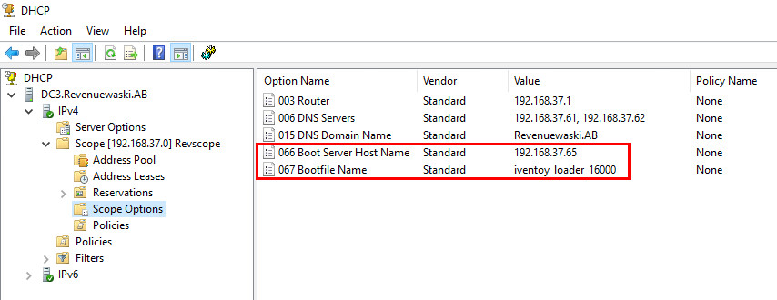
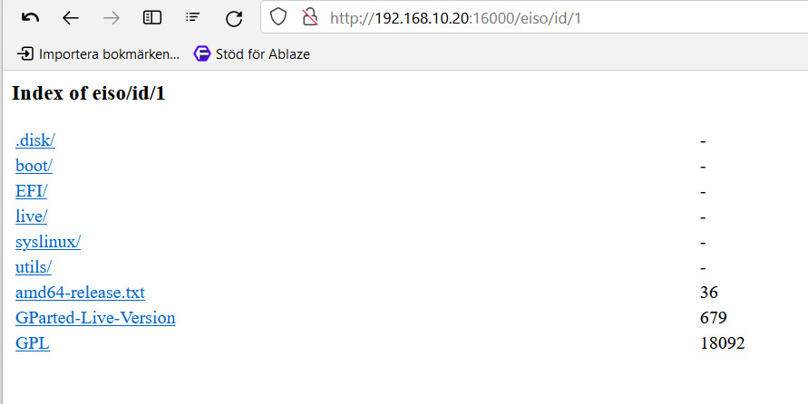

# Inställningar

<!-- toc -->

## Extern DHCP-server inom samma nät

  

I Scope Options måste följande läggas till:  

- Option 066: Adressen till iVentoy-servern fylls i här.  

- Option 067: Filnamnet som klienten skall ladda.  

## Växlar  

iVentoy har två växlar som kan utnyttjas vid behov på kommandoraden.  

- `-A` iVentoy lyssnar via http://0.0.0.0:26000 d.v.s. alla enheter i nätet. Använd vid anslutningsproblem.  

- `-R` Startar och kör servern med senast valda konfiguration.

Exempel:

- Linux: `sudo bash iventoy.sh -A start`  

- Windows: `.\iventoy.exe -R`  

## iVentoy HTTP URL

Filer i mapparna __iso__ och __user__, respektive deras undermappar, kan nås direkt via sökväg.

Exempel:

> http://192.168.10.100:16000/__iso__/Windows.iso
> http://192.168.10.100:16000/__user__/Software/Tetris.7z  

ISO-filer kan också nås via __riso__ + ISO-__ID__ eller __PMD5__.

Exempel:

> http://192.168.10.145:16000/__riso__/__id__/1.iso
> http://192.168.10.100:16000/__riso__/__pmd5__/a941e235e8cc9b3dcd1afcd43468ed58.iso  

Det går också att bläddra i ISO-filerna med  __eiso__ + ISO-__ID__ eller __PMD5__.

Exempel:  

> http://192.168.10.20:16000/__eiso__/__id__/1.iso>
> http://192.168.10.20:16000/__eiso__/__pmd5__/e73acde9367248eb41d639853fbf145f.iso  

   

  
