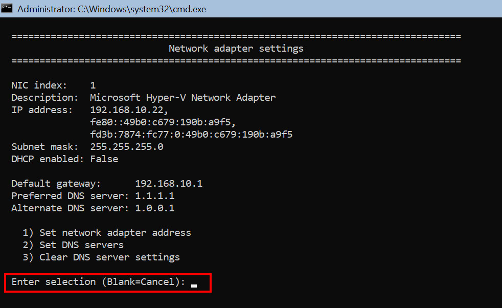

# Windows Server 2022 Standard  

<!-- toc -->

## Start  

Installera i VM. Lösenord ombeds bytas vid första inloggningen och därefter startar Sconfig:

  

Välj genom att skriva in en siffra och tryck <kbd>Enter</kbd>. För att exempelvis ändra nätverksinställningar så väljer man siffran 8:  

  

Man guidas genom processen för konfigurationen. 

I första menyfönstret väljer man 15 för att komma till Powershell. För att komma tillbaka till menyfönstret mata in `sconfig` och tryck <kbd>Enter</kbd>.  

</br>  

> [!Tips]
> Med <kbd>Ctrl</kbd> + <kbd>Alt</kbd> + <kbd>Shift</kbd> + <kbd>?</kbd> så visas en lista över kortkommandon.  

## Stäng av brandväggen  

För att se status på brandväggen mata in:  

````powershell
Get-NetFirewallProfile | Format-Table
````

Stäng av brandväggen med:  

````powershell
Set-NetFirewallProfile -Profile Domain, Public, Private -Enabled False
````  

## ISO

Ladda ner iVentoy <https://github.com/ventoy/PXE/releases> på en extern enhet och packa upp filen. Skapa en ISO med [Imgburn](./imgburn.md) och lägg till iVentoy, OS-ISO och eventuell [skriptfil](./skript.md).  

</br>  

  

Montera ISO:n i VM:et. Lista enheter med `Get-Volume`. ISO:n är monterad på enhet D.  

</br>  

  

Mata in `cd d:` och sen `ls` för att se filerna på D. Flytta iVentoy-mappen till enhet C med:  

```powershell
cp .\iventoy-1.0.20\ c: -recurse
```  

och eventuell skriptfil med:  

```powershell
cp .\autounattend.xml c:\iventoy-1.0.20\user\scripts\
```  

Länka Windows.iso-filen symboliskt:  

```powershell  
New-Item -Path C:\iventoy-1.0.20\iso\Windows.iso -ItemType SymbolicLink -Value D:\Windows.iso
```  

## Installera iVentoy

För att iVentoy skall kunna köras måste Microsoft Visual C++ Redistributable laddas ner och installeras. 

För att ladda ner mata in:  

```powershell
wget "https://aka.ms/vs/17/release/vc_redist.x64.exe" -OutFile "C:\vc_redist.x64.exe"
```

Gå till `C:\` med `cd c:` och installera med:  

````powershell
.\vc_redist.x64.exe
````  

Ta bort filen med `rm .\vc_redist.x64.exe -force`. Gå in i iVentoy-mappen med `cd .\iventoy-1.0.20\`. Mata in `tree /f` för att se strukturen i mappen. För att starta iVentoy mata in `.\iVentoy_64.exe`.  

</br>  

  

Ett litet fönster dyker upp som kan gömma sig bakom terminalfönstret. Klicka på <kbd>Exit</kbd> knappen när iVentoy skall avslutas.  

Öppna en webbläsare på en extern enhet och skriv in adressen till datorn iVentoy är installerad på och ange port 26000. Exempel: http://192.168.10.22:26000 [Klicka](iventoy.md) för snabbguide.  
